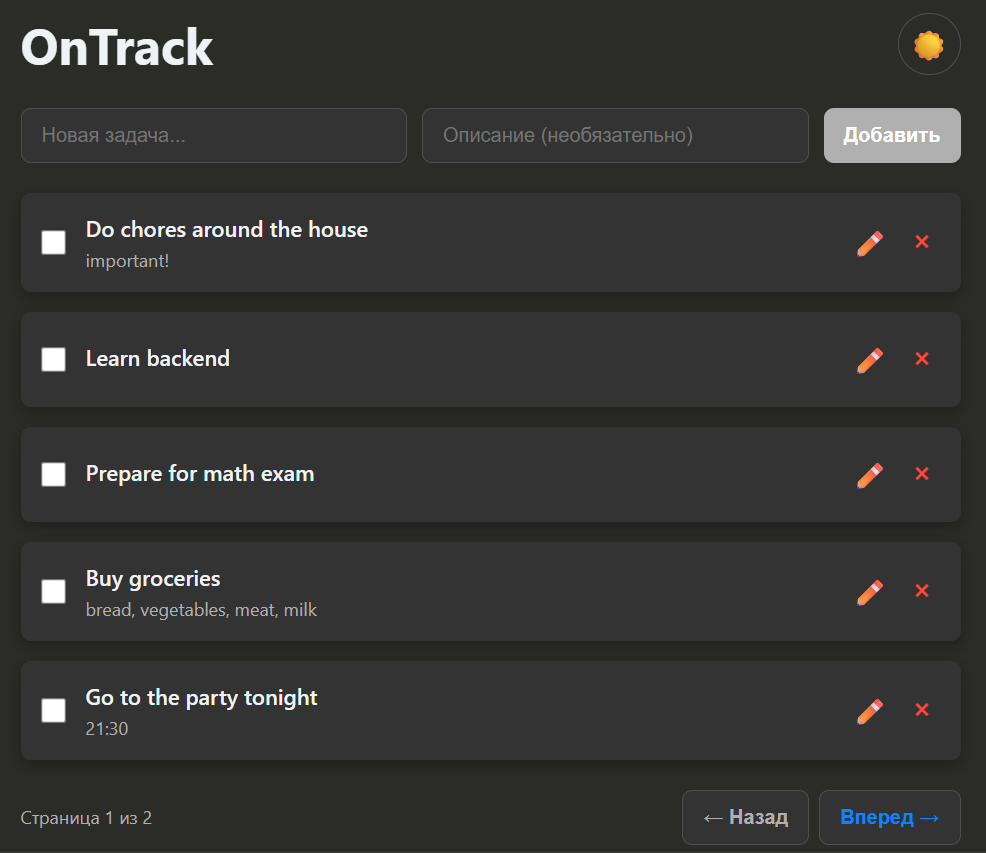

# OnTrack  
Full stack web application for task management, built with a clean architecture and a fully containerized environment. Designed for simplicity, speed, and scalability.


## Technology Stack

### Backend
- **Go**
- **Gin Framework**

### Frontend
- **TypeScript**
- **React**

### Database
- **PostgreSQL**

### Deployment & Infrastructure
- **Docker** — the entire system (backend, frontend, database) is packaged into Docker containers


## How to run locally
```bash
git clone https://github.com/rod1kutzyy/OnTrack
cd OnTrack
docker-compose up -d
```


## Overview



## Backend Structure

```bash
backend/
├── cmd/
│   └── api/
│       ├── main.go       # Application entry point
│       ├── router.go     # Gin router setup & route registration
│       └── server.go     # HTTP server initialization and startup
│
├── docs/                 # API documentation (Swagger)
│
├── internal/
│   ├── config/           # Application configuration (env loading, settings)
│   │
│   ├── domain/           # Core business entities
│   │   └── ...
│   │
│   ├── dto/              # Data Transfer Objects for requests/responses
│   │
│   ├── handler/          # HTTP handlers (controllers)
│   │   └── ...
│   │
│   ├── infrastructure/   # PostgreSQL connection
│   │   └── database/   # Database setup
│   │
│   ├── logger/           # Centralized logging configuration
│   │
│   ├── middleware/       # Custom Gin middlewares (recovery, logging)
│   │
│   ├── repository/       # Persistence layer (CRUD, SQL queries)
│   │   └── ...
│   │
│   ├── usecase/          # Business logic / application services
│   │   └── ...
│   │
│   └── validator/        # Input validation logic, struct validators
│
├── .env                  # Environment variables
├── Dockerfile            # Backend Docker configuration
├── go.mod
└── go.sum


```